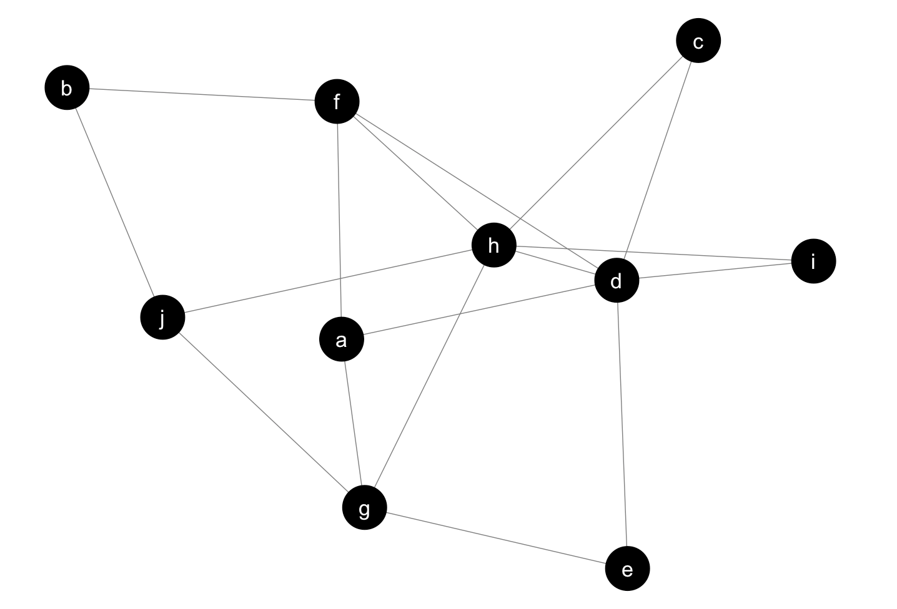

```{r setup, include=FALSE}
knitr::opts_chunk$set(echo = FALSE)
knitr::opts_chunk$set(message = FALSE)
knitr::opts_chunk$set(warning = FALSE)
knitr::opts_chunk$set(fig.align = "center")
```

```{r}
library(tidyverse)
library(forcats)
library(gridExtra)
library(knitr)

library(tm)
library(SnowballC)
library(wordcloud)
library(RColorBrewer)

library(gapminder)
library(gganimate)
library(ggrepel)
library(ggthemes)
```
<style>
h2 {
text-align: center;
font-size: 150%;
}

.middle {
text-align: center;
}

</style>

# Data Visualization Using ggplot2

## Overview of the Presentation

###1. Introduction to Data Visualization

###2. Introduction to ggplot

###3. Overview of the Gapminder Dataset

###4. Visualizing Gapminder

###5. Extension libraries to ggplot2


## Role of Data Visualization


<b>Figure:</b> Data Science Project Workflow

<b>Source: http://r4ds.had.co.nz/introduction.html</b>

## Data Visualization tools

```{r, fig.width=10, fig.height=5}

text <- "Tableau, ggplot2, seaborn, matplotlib, plotly, pandas, DataHero, Chart.js, ZingChart, Exhibit, Leaflet, WolframAlpha, Visual.ly, FusionCharts, D3.js, Google Charts, Excel, Excel, Tangle, Polymaps, OpenLayers, CartoDB, Processing, NodeBox, iCharts, Flot, ggplot2, ggplot2,ggplot2, Tableau, seaborn, matplotlib, matplotlib, Excel, Google Charts, pandas, plotly, cufflinks, WolframAlpha, Gephi, Weka, Kartograph, OpenLayers, Polymaps,Crossfilter, Highcharts, jpGraph, raw, Dygraphs, ZingChart, InstantAtlas, Timeline, Exhibit, Modest Maps, Leaflet, Visual.ly, Visualize Free, Better World Flux, PowerBI, PowerBI, PowerBI"


docs <- Corpus(VectorSource(text))

#inspect(docs)

toSpace <- content_transformer(function (x , pattern ) gsub(pattern, " ", x))
docs <- tm_map(docs, toSpace, "/")
docs <- tm_map(docs, toSpace, "@")
docs <- tm_map(docs, toSpace, "\\|")


dtm <- TermDocumentMatrix(docs)
m <- as.matrix(dtm)
v <- sort(rowSums(m),decreasing=TRUE)
d <- data.frame(word = names(v),freq=v)
#head(d, 10)

set.seed(1234)
wordcloud(words = d$word, freq = d$freq, min.freq = 1,
          random.order=FALSE, colors=brewer.pal(10, "Dark2"))
```


## Introduction to ggplot2

### 1. ggplot2 is a data visualization package for the statistical programming language `R`.

### 2. Created by `Hadley Wickham` in 2005

### 3. Implementation of `Leland Wilkinson's Grammar of Graphics`

### 4. Easy plotting with `qplot` function

### 5. Complex plotting with `ggplot` function

### 6. ggplot for python


## Why ggplot2?

### 1. Free and open source

### 2. Professional quality graphs

### 3. Literate programming

### 4. Easy superpositioning (Multiple Plots in a graph)

### 5. Multiple themes + ggthemes

### 6. Large number of extension libraries

## 7. Tidyverse - R packages for Data Science
<div class="middle">

<br>
<b>Source: https://www.tidyverse.org</b>
</div>

## Gapminder DataFrame

```{r}
kable(head(gapminder %>% filter(country == "Canada"),8))
```

### Sample dataframe from 1704 records of the Gapminder dataset.

# Gapminder Visualizations

## GDP Per Capita in 1987 - Boxplot

```{r, fig.width=10, fig.height=5}
ggplot(subset(gapminder, year == 1987, continent != "Oceania"), aes(continent, gdpPercap)) +
  geom_boxplot(aes(fill = continent)) +  
  labs(x = "Continent", y = "GDP Per Capita") + theme_bw() +
  scale_fill_brewer("Continent", palette = "Set1") + scale_y_continuous(labels = scales::dollar_format())
```

## GDP Per Capita in 1987 - Boxplot + Jitter Plot

```{r, fig.width=10, fig.height=5}
ggplot(subset(gapminder, year == 1987, continent != "Oceania"), aes(continent, gdpPercap)) +
  geom_boxplot(aes(fill = continent)) +  
  labs(x = "Continent", y = "GDP Per Capita") + theme_bw() +
  scale_fill_brewer("Continent", palette = "Set1") + geom_jitter(alpha = 0.4) + scale_y_continuous(labels = scales::dollar_format())
```


## Geographical plotting of GDP Per Capita in 2007

```{r, fig.width=10, fig.height=5}


world<- map_data("world")

gapminder_df <- gapminder %>% filter(year == 1952) %>% 
  mutate(code = countrycode::countrycode(country,"country.name", "iso2c"))

world <- world %>% 
  mutate(code = countrycode::countrycode(region,"country.name", "iso2c"))

df <- left_join(world, gapminder_df, by = "code")

gapminder_df7 <- gapminder %>% filter(year == 2007) %>% 
  mutate(code = countrycode::countrycode(country,"country.name", "iso2c"))

df7 <- left_join(world, gapminder_df7, by = "code")


df7 %>%	ggplot() + geom_polygon(aes(x = long, y = lat, group = group, fill = gdpPercap)) +
  scale_fill_distiller("GDP Per Capita", palette="RdYlGn", direction = 1, labels = scales::dollar_format()) +
  labs(x = "Longitude", y = "Latitude") +
  theme_void()
```


## Contributions to Continent GDP in 2007 - Stacked Bar Plot

```{r, fig.width=10.25, fig.height=5.25}

'%!in%' <- function(x,y)!('%in%'(x,y))

theme_dark <- theme_hc(bgcolor = "darkunica") +
  theme(axis.text.x = element_text(colour="white"),
        axis.text.y = element_text(colour="white"),
        plot.title = element_text(hjust = 0.5),
        axis.ticks = element_blank(),
        axis.line = element_blank(),
        legend.position = "none")

my_countries <- c("United States", "Brazil", "Mexico", "Canada", "Argentina", "China", "Japan", "India", "Korea, Rep.","Iran", "Germany", "United Kingdom", "France", "Italy", "Spain", "Netherlands", "Australia", "New Zealand", "Egypt")

q1 <- gapminder %>% filter(country %in% my_countries, year == 2007)%>% 
  mutate(gdp = pop * gdpPercap) %>%  select(continent, country, gdp)

q2 <- gapminder %>% filter(country %!in% my_countries, year == 2007)%>% 
  mutate(igdp = pop * gdpPercap) %>% group_by(continent) %>% summarise(gdp = sum(igdp)) %>% mutate(country = paste("Rest of",continent))

country_colors["Rest of Africa"] <- "#3f3f3f"
country_colors["Rest of Americas"] <- "#3f3f3f"
country_colors["Rest of Asia"] <- "#3f3f3f"
country_colors["Rest of Europe"] <- "#3f3f3f"

bind_rows(q2,q1) %>% ggplot(aes(x = continent, y = round(gdp/1000000000) , fill = fct_reorder(country,gdp, .desc = TRUE)))+ 
  geom_col(color = "black", size = 0.2) +
  guides(fill = FALSE) + 
  theme_dark+
  scale_fill_manual(values = country_colors) + 
  geom_label(aes(label = country ), color = "white",position = position_stack(vjust=1), size = 3) +
  labs(x = "Continent" , y = "GDP in Trillions") + 
  scale_y_continuous(labels = scales::dollar_format())

```

## Life Expectancy in 1987 - Violin Plot

```{r, fig.width=10, fig.height=5}
gapminder %>% filter(continent != "Oceania", year == 1987) %>% droplevels() %>% ggplot(aes(continent, lifeExp)) + geom_violin(aes(fill = continent)) +  
  labs(x = "Continent", y = "Life Expectancy") + theme_bw() +
  scale_fill_brewer("Continent", palette = "Set1")
```

## Life Expectancy in 1987 - Violin Plot + Jitter Plot

```{r, fig.width=10, fig.height=5}
ggplot(subset(gapminder, year == 1987), aes(continent, lifeExp)) +
  geom_violin(aes(fill = continent)) +  
  labs(x = "Continent", y = "Life Expectancy") + theme_bw() +
  scale_fill_brewer("Continent", palette = "Set1") + geom_jitter(alpha = 0.4)
```


## Life Expectancy Trends in Continents

```{r, fig.width=10, fig.height=5}

jXlim <- c(150, 115000)
jYlim <- c(16, 100)

ggplot(subset(gapminder, continent != "Oceania"),
       aes(x = year, y = lifeExp, group = country, color = country)) +
  geom_line(lwd = 1, show_guide = FALSE) + facet_wrap(~ continent) +
  scale_color_manual(values = country_colors) +
  labs(x = "Year", y = "Life Expectancy") +
  theme_bw() + theme(strip.text = element_text(size = rel(1.1)))
```

## African Life Expectancy in 1952 & 2007

```{r, fig.width=10, fig.height=5}

world<- map_data("world")
gapminder_df1 <- gapminder %>% filter(continent == "Africa") %>% 
  mutate(code = countrycode::countrycode(country,"country.name", "iso2c"))
world <- world %>% 
  mutate(code = countrycode::countrycode(region,"country.name", "iso2c"))
df1 <- left_join(world, gapminder_df1, by = "code")

df1 %>% filter(!is.na(gdpPercap), year %in% c(1952, 2007)) %>%  ggplot() + 
  geom_polygon(aes(x = long, y = lat, group = group, fill = lifeExp)) +
  facet_wrap(~year, scales = "free")  +
  scale_fill_distiller("Life Expectancy", palette="RdYlGn", direction = 1) +
  theme_bw() +
  theme(axis.text.x=element_blank(),axis.ticks.x = element_blank(),
        axis.title.x = element_blank(), axis.text.y=element_blank(),
        axis.ticks.y = element_blank(), axis.title.y = element_blank(), 
        strip.text = element_text(size = 12))


```


## Change in Life Expectancy in Africa - Bar Plot

```{r, fig.width=10, fig.height=5}

africa <- c("Swaziland","Mozambique","Zambia","Sierra Leone","Lesotho","Angola","Zimbabwe", "Liberia","Rwanda","Guinea-Bissau","South Africa","Cameroon","Tanzania","Kenya","Congo, Rep.","Eritrea","Ghana","Morocco","Mauritius","Libya","Reunion")


d1 <- gapminder %>% filter(country %in% africa , year == 1952) %>% mutate(life_1952 = lifeExp)
d2 <- gapminder %>% filter(country %in% africa , year == 2007) %>% mutate(life_2007 = lifeExp)

inner_join(d1,d2 , by="country") %>% 
  mutate(difference = life_2007 - life_1952) %>% 
  select(difference, country, continent.x) %>% 
  ggplot(aes(fct_reorder(country, difference, .desc = T))) + 
  geom_bar(aes(weight = difference), fill = "dodgerblue3", color = "black") +  theme_bw() +
  geom_label(aes(country, difference, label = round(difference,1))) +
  theme(axis.text.x=element_text(angle=90,hjust=1,vjust=0.5)) +
  labs(x = "Country", y = "Years") + 
  theme(title = element_text(size = 15), axis.text.x = element_text(size = 12))

  #gapminder %>% filter(year == 2007, continent == "Africa") %>% arrange(lifeExp)
  
```

## Life Expectancy Trend in Continents

```{r, fig.width=10, fig.height=5}
jCountries <- c("Canada", "Rwanda", "Cambodia", "Swaziland","Mozambique")
ggplot(subset(gapminder, country %in% jCountries),
       aes(x = year, y = lifeExp, color = reorder(country, -1 * lifeExp, max))) +
  geom_line() + geom_point() + theme_bw() + 
  labs(x = "Year", y = "Life Expectancy") +
  scale_color_brewer("Countries", palette = "Set1")
#gapminder %>% filter(year == 2007) %>% arrange(lifeExp)
```


## Life Expectancy in Africa in 2007 - Polar Bar Plot

```{r, fig.width=8, fig.height=6, message=FALSE, warning=FALSE, fig.align='center'}
africas <- c("Mauritius","Swaziland","Mozambique","Zambia","Angola","Libya" ,"Lesotho","Angola","Zimbabwe", "Liberia","Rwanda","Morocco","Guinea-Bissau","South Africa","Cameroon","Tanzania","Kenya","Congo, Rep.","Eritrea","Ghana","Comoros","Egypt","Mauritania", "Madagascar", "Senegal")

gapminder %>% filter(country %in% africas , year == 2007) %>% ggplot(aes(country)) + 
  geom_bar(aes(weight = lifeExp, fill = lifeExp)) +  theme_minimal() +
  geom_label(aes(country, lifeExp, label = round(lifeExp,1)), size = 3, label.padding = unit(0.10, "lines")) +
  theme(axis.text.x=element_text(angle=0,size = 9), axis.text.y=element_blank(), axis.ticks.y = element_blank(), axis.title.y = element_blank()) +
  labs(x = "Country", y = "Years") + 
  coord_polar() + scale_fill_distiller("Years", palette="Reds", direction=1)

```


## GDP Per Capita Vs Life Expectancy in 2007

```{r, fig.width=10, fig.height=5}

gapminder %>% filter(continent != "Oceania", year == 2007) %>%
  ggplot(aes(x = gdpPercap, y = lifeExp)) +
  geom_point(aes(size = (pop), fill = country), shape = 21, alpha = 0.9) +
  guides(fill = FALSE, size = FALSE) +
  facet_wrap(~continent) +
  scale_fill_manual(values = country_colors) + 
  scale_x_log10(limits = jXlim, labels = scales::dollar_format()) + ylim(jYlim) +
  scale_size_continuous(range=c(1,40)) +theme_bw() +
  theme(strip.text = element_text(size = rel(1.1))) + 
  labs(x = "GDP Per Capita", y = "Life expectancy")

```


## GDP Per Capita & Life Expectancy - Linear Model

```{r, fig.width=10, fig.height=5}


jXlim <- c(150, 115000)
jYlim <- c(16, 100)

gapminder %>% filter(continent != "Oceania") %>%
  ggplot(aes(x = gdpPercap, y = lifeExp)) +
  geom_point(aes(size = (pop), fill = country), shape = 21, alpha = 0.9) +
  guides(fill = FALSE, size = FALSE) +
  scale_fill_manual(values = country_colors) + 
  scale_x_log10(limits = jXlim, labels = scales::dollar_format()) + ylim(jYlim) +
  scale_size_continuous(range=c(1,10)) + theme_bw() +
  theme(strip.text = element_text(size = rel(1.1)))+
  labs(x = "GDP Per Capita", y = "Life expectancy") + geom_smooth(size = 2, method = "lm")
```


## GDP Per Capita & Life Expectancy - Non Linear Model

```{r, fig.width=10, fig.height=5}


jXlim <- c(150, 115000)
jYlim <- c(16, 100)

gapminder %>% filter(continent != "Oceania") %>%
  ggplot(aes(x = gdpPercap, y = lifeExp)) +
  geom_point(aes(size = (pop), fill = country), shape = 21, alpha = 0.9) +
  guides(fill = FALSE, size = FALSE) +
  scale_fill_manual(values = country_colors) + 
  scale_x_log10(limits = jXlim, labels = scales::dollar_format()) + ylim(jYlim) +
  scale_size_continuous(range=c(1,10)) + theme_bw() +
  theme(strip.text = element_text(size = rel(1.1)))+
  labs(x = "GDP Per Capita", y = "Life Expectancy") + geom_smooth(size = 2)
```

# ggplot2 Extensions

## Spatial Data - ggmap

```{r}

col_pt <- brewer.pal(n=8, name = "Paired")[2]
col_accent <- brewer.pal(n=8, name = "Paired")[6]
col_bg <- brewer.pal(n=8, name = "Paired")[8]

suppressPackageStartupMessages(library(ggmap))
set.seed(23)
dat <- tibble(x=runif(20)*0.01-123.2525,
              y=runif(20)*0.008+49.257)
get_googlemap(center=c(-123.247985, 49.261263), zoom=16) %>% 
    ggmap(base_layer = ggplot(dat, aes(x,y))) +
    geom_point(size=5, colour=col_pt) +
    theme_bw() +
    xlab("Longitude") +
    ylab("Latitude")
```

## Network Graphs - ggnet2


<div class = "middle"> 

<br>
 <b>Source: https://briatte.github.io/ggnet/</b>
</div>

```{r, fig.height=5, fig.width=6, fig.align='center', eval=FALSE}
#Simple igraph
suppressPackageStartupMessages(library(igraph))
dat <- make_graph(c("A","B",  "A","C",  "A","D",  "B","C",  "C","B"), 
                  directed=TRUE)
plot(dat)
```

## 3D Plots - Plotly R Library

<div class = "middle"> 

<br>
<b>Source: https://plot.ly/r/</b>
</div>


## References

1. https://github.com/jennybc/ggplot2-tutorial

2. https://medium.com/optima-blog/using-polar-coordinates-for-better-visualization-1d337b6c9dec

3. http://r4ds.had.co.nz

4. http://www.stat.columbia.edu/~tzheng/files/Rcolor.pdf