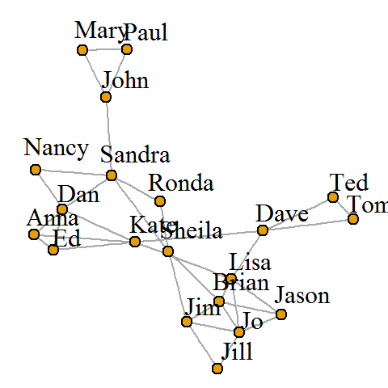

```{r setup, include=FALSE}
knitr::opts_chunk$set(echo = FALSE)
knitr::opts_chunk$set(message = FALSE)
knitr::opts_chunk$set(warning = FALSE)
knitr::opts_chunk$set(fig.align = "center")
```

```{r}
library(tidyverse)
library(forcats)
library(gridExtra)
library(knitr)

library(tm)
library(SnowballC)
library(wordcloud)
library(RColorBrewer)

library(gapminder)
library(gganimate)
library(ggrepel)
library(ggthemes)
```
<style>
h2 {
text-align: center;
font-size: 150%;
}

.middle {
text-align: center;
}
</style>


## Directed Graphs - igraph


<div class = "middle"> 

<br>
 <b>Source: http://kateto.net/netscix2016 </b>
</div>
